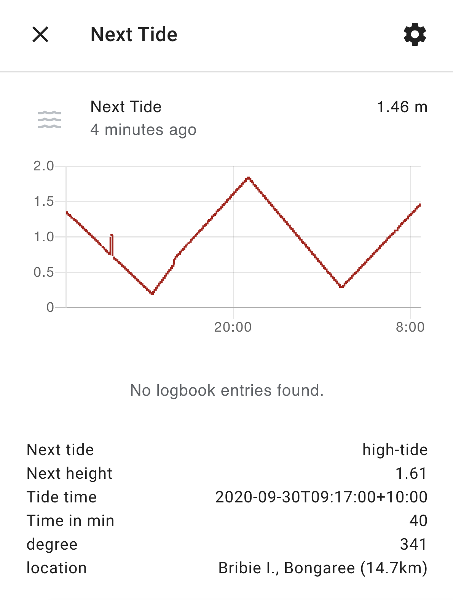
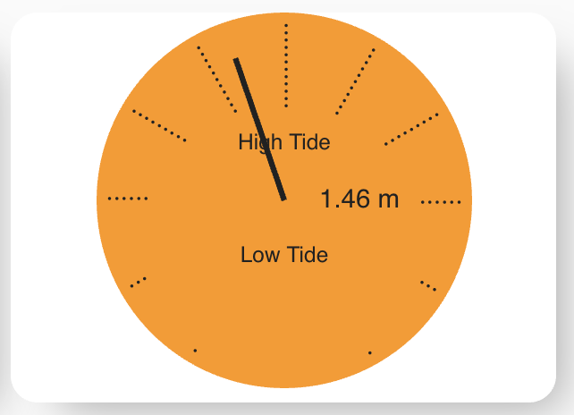

# TidesAustralia
Appdaemon app pulling Australian tidal information (BOM)

## Setup
sensor_tide.py contains the main Appdaemon app to pull the tidal information from BOM. The sensor will default to the closesed location based on your long/lat values in the Appdaemon config. Alternativly, a location can be specified in the app configuration. 

Both use cases are shown in the sensor_tide.yaml file.

If you want to use the clock face visualisation of the tides you have to add the tide_card.js to you www directory of Home Assistant. Once done it can be linked in your Lovelace dashboard to the tidal sensor. 

## Output

The app will create a sensor with a number of attributes. The state provides the estimated current tide level (liniar extrapolation). Attribute values include 
* Next tide
* Next tide hight
* Next tide time
* Time in min
* Time in min translated to a degree value (used for the tide clock)

